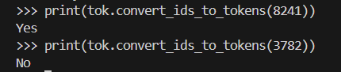

# Downloading microsoft MIND news dataset
export KAGGLE_USERNAME=YOUR_KAGGLE_USERNAME
export KAGGLE_KEY=YOUR_API_KEY

kaggle datasets download -d arashnic/mind-news-dataset -p raw_data/mind --unzip

# For deepseek R1 distilled:

model_id = "deepseek-ai/DeepSeek-R1-Distill-Llama-8B"

# troubleshooting version incompability (for cuda version 12.X)

python -m pip uninstall -y bitsandbytes triton torch torchvision torchaudio
python -m pip cache purge

python -m pip install --no-cache-dir --index-url https://download.pytorch.org/whl/cu121 \
  "torch==2.4.1" "torchvision==0.19.1" "torchaudio==2.4.1"

python -m pip install --no-cache-dir "triton==3.0.0"
python -m pip install --no-cache-dir "bitsandbytes==0.43.3"

